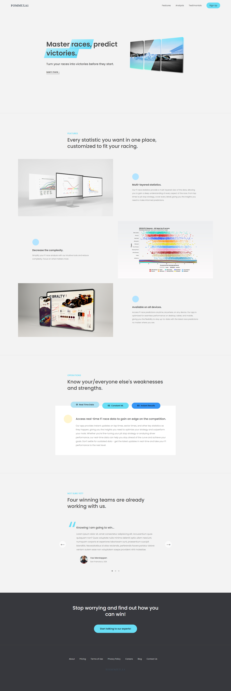

  

##  1. Introduction

### 1.1 Overview

Welcome to Fommula1, the ultimate real-time data analysis app designed to
transform Formula 1 racing strategies through the power of statistics and
machine learning. Our mission is to provide F1 teams with invaluable insights
and actionable recommendations that lead to improved performance and race
outcomes.

In the high-octane world of Formula 1 racing, every millisecond counts. The
difference between winning and losing can hinge on the smallest of details. F1
Insight is here to help you harness the power of data to make informed
decisions, optimize strategies, and gain a competitive edge over your rivals.

Our platform leverages cutting-edge machine learning algorithms and vast
historical race data to analyze a multitude of variables in real-time, including
track conditions, tire performance, fuel consumption, driver behavior, and much
more. By processing this complex information, F1 Insight delivers accurate
predictions and strategic recommendations that adapt to the ever-changing
dynamics of each race.

### 1.2 Key Features

Real-time data analysis: Stay ahead of the competition with live monitoring of
crucial race parameters, enabling you to make data-driven decisions at every
stage of the race.

Machine learning-driven insights: Benefit from our advanced algorithms that
learn from historical data and adapt to new information, providing you with
accurate and reliable predictions.

Customizable dashboards: Tailor your F1 Insight experience to suit your team's
specific needs, focusing on the most relevant data points for your strategy.

Seamless integration: Integrate F1 Insight with your existing telemetry systems
and data sources, ensuring a smooth and consistent flow of information.

Secure and reliable: Trust in our commitment to data privacy and security,
safeguarding your team's sensitive information at all times.

Embrace the future of Formula 1 racing with Fommula1 and propel your team to
new heights. Discover the power of data-driven strategies and unlock your team's
full potential on the track. Let's start this thrilling journey together towards
championship glory.

### 1.3 Front-end Development Stack

- Javascript
- CSS
- HTML

## 2. Landing Page

  

## 3. Disclaimer and Purpose

Fommula1 is a front-end mockup application designed to simulate the appearance
and functionality of a real-time data analysis platform for Formula 1 racing. It
is essential to note that Fommula1 does not use any proprietary or confidential
information obtained directly from Formula 1 or its associated entities, nor
does it utilize actual data for analysis.

As a front-end demonstration, Fommula1 employs static, placeholder data and
presents a user interface that mimics a genuine app. The purpose of Fommula1 is
to showcase design and development skills, highlighting the potential for
creating a data-driven decision-making tool in the world of Formula 1 racing.

Please be aware that Fommula1 is a conceptual project and not a fully functional
platform for real-world application.

(<a href="#top">back to top</a>)

<!-- CONTACT -->
## 4. Contact

Erol Gelbul - [Website](erolgelbul.com)

Project Link: [Fommula 1](https://github.com/ErolGelbul/fommula1_landing)

(<a href="#top">back to top</a>)

